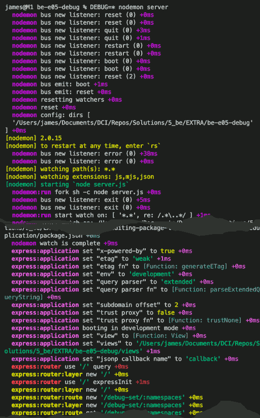

# Using debug

Many node modules use the `debug` module to log run-time information to the console.

For example, `node_modules/express/lib/application.js` contains the following lines:

```javascript=
21  |  var debug = require('debug')('express:application');
... |
358 |  debug('set "%s" to %o', setting, val);
```

If you use this command to start the app...

```bash
DEBUG=express:application node server
```
... this will produce output in the console that might start like this: 

```bash
  express:application set "x-powered-by" to true +0ms
  express:application set "etag" to 'weak' +1ms
  express:application set "env" to 'development' +0ms
  express:application set "query parser" to 'extended' +0ms
  express:application set "subdomain offset" to 2 +1ms
  express:application set "trust proxy" to false +0ms
```

`"express:application"` is an example of a _namespace_. As you will see, when you set up a `debug` function, you tell the function what namespace it is to use. All output in the Console pane will be prefixed with that namespace.

Namespaces can use the `:` separator, so that you can create namespaces like `"projectname:modulename:feature"`, and the display in the Console will be explicit about which area of your code generated each particular output line.

`*` is a catchall shortcut. On its own, it is a shortcut that means "all namespaces for all modules". When placed after a colon (like `express:*`), it means "all namespaces that start with (say) `express:`. When placed before a colon (like `*:application`), it means "all namespaces that end with `application`.

---

If you set the environment variable `DEBUG` to `*` then all the calls to a function created with the `debug` module will log their data in the console. Try it:

```bash
DEBUG=* nodemon server
```

You might see logging with each of the following namespaces, each with a different colour.

```bash
nodemon
nodemon:run
nodemon:watch
nodemon:match
express:application
express:router
express:router:layer
express:router:route
```



---

Sometimes it is useful to see the debug output from modules that you are using. You can enable such output in any of three places:

* **On the command line**, as you have just done:  
  `DEBUG=express:application node server`  
  `DEBUG=* nodemon server`  
* **In a `.env` file** at the root of your project. For example:  
  `DEBUG=express:router:*`  
  You would then start your app normally: `node server`  
  **NOTE:** If you use a `.env` file to set your environment variables, then you must also install the `dotenv` module, and call `require('dotenv').config()` very soon after your app first starts.
* **In a command in** the "scripts" section of **`package.json`**. This is what the "start" script currently looks like:
  ```json
  { ...
    "scripts": {
      "start": "DEBUG=app:* nodemon server.js"
    },
  }
  ```
  **NOTE:** Environment variables set in a script in `package.json` will overwrite any variables with the same name set in a `.env` file. You could use a special script like...  
  `  "debug": "DEBUG=* nodemon server.js"`  
  ... and call `npm run debug` when you want to see all debug logs.
  
  > See the [documentation for debug](https://www.npmjs.com/package/debug#usage) for more details on how to select specific namespaces.

---

When you are developing your own server application, you probably don't want to see all the debug data for every npm package. You probably don't even want to see the debug data that your colleagues are using as they develop their own modules for your project.

You can agree on a convention with your colleagues about how you will name your namespaces. For instance, you might use a convention like: `ourproject:codername:feature`. This would allow you to:
* Switch on all debug output for the project by setting `DEBUG=ourproject:*`
* Switch on all debug output for a given coder by setting `DEBUG=ourproject:codername:*`
* Switch on all debug output for a given feature by setting `DEBUG=ourproject:*:feature`

## Creating a `debug` Function

A debug function is like a customizable, hideable `console.log` function.

To create a debug function, you need to:

1. Install the debug module. Run `npm i debug` in the Terminal
2. In a JavaScript file, create a variable to hold the `debug` function: `const debug = require('debug')`
3. Call the function to create a logger function with a given namespace: `const logger = debug("name:space")`

You can then use your logger function to log messages to the Console:

```javascript
logger("message string")
```
>  **name:space**  message string
  
## Switching `debug` Functions On and Off With Code

Not only can you decide which namespaces are enabled by setting `process.env.DEBUG` appropriately. You can also enable and disable namespaces at runtime.

> See the [documentation for debug](https://www.npmjs.com/package/debug#user-content-set-dynamically) for more details on how to enable and disable namespaces, and how to check if the function that uses a specific namespace is currently enabled.

If you run `npm start`, the script `"DEBUG=app:* nodemon server.js"` will be executed. This enable all namespaces that start with `app:` and will run all the code in the `debug.js` file.

Take a look at the output in the Console, and then study the `debug.js` script. In particular, ask yourself:
* How are the different debug functions and namespaces created?
* How does the `runDebugDisableTests` enable and disable namespaces?
* Are there namespaces that cannot be disabled?

## Switching `debug` Functions On and Off From the Browser

The `server.js` script imports the debug functions (indirectly) from `debug.js` and uses them if they are enabled. The `server.js` script also imports a function called `debugSetNamespaces`. It defines an endpoint which calls this function:

```javascript
app.get("/debug-set/:namespaces", debugSetNamespaces)
```

This makes it possible to use the browser to enable and disable namespaces on the server, simply by providing the appropriate `param` in the URL. Try visiting the following URLs in browser:

* http://localhost:3001
* http://localhost:3001/debug-set/off:*
* http://localhost:3001/debug-set/
* http://localhost:3001/debug-set/none
* http://localhost:3001/debug-set/app:*
* http://localhost:3001/debug-set/*
* http://localhost:3001

Observe how the output in the Console changes. As different namespaces are enabled and disabled, so different data is logged in the Console.

The `debugSetNamespaces` function serves a simple page to the browser to give feedback on the currently enabled functions and namespaces.

---

## Limitations

Now try two more endpoints:

* http://localhost:3001/debug-set/express:*
* http://localhost:3001/debug-set/app:*,express:*
  
These do **not** switch on the `express:` namespaces. You will not see any **express:** output in the Console.

This is because Express uses its own copy of `debug`. You can use `npm list debug` to ask `npm` to list all the copies of `debug` in the `node_modules` directory. You should see something like this:

```bash
npm list debug
debug@1.0.0 /path/to/be-e05-debug
├── debug@4.3.4
├─┬ express@4.17.3
│ ├─┬ body-parser@1.19.2
│ │ └── debug@2.6.9
│ ├── debug@2.6.9
│ ├─┬ finalhandler@1.1.2
│ │ └── debug@2.6.9
│ └─┬ send@0.17.2
│   └── debug@2.6.9
└─┬ nodemon@2.0.15
  └── debug@3.2.7
```
The version of `debug` that you explicitly installed appears at the top of the list: version 4.3.4. Express uses its own copy: version 2.6.9. All copies of `debug` will read the value of `process.env.DEBUG` when they start up, so you can enable all the namespaces that you want at start up, but you won't be able to disable them or enable others later.

If controlling all namespaces is important to you, there is a solution. But that's the subject of [a different article](editing-package-lock-json/README.md).